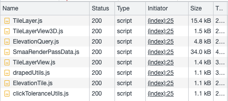
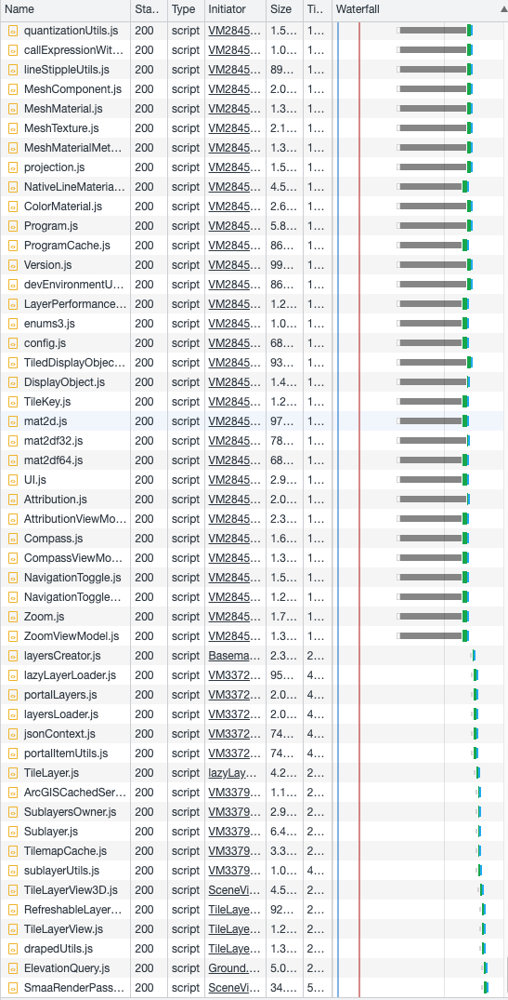
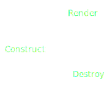
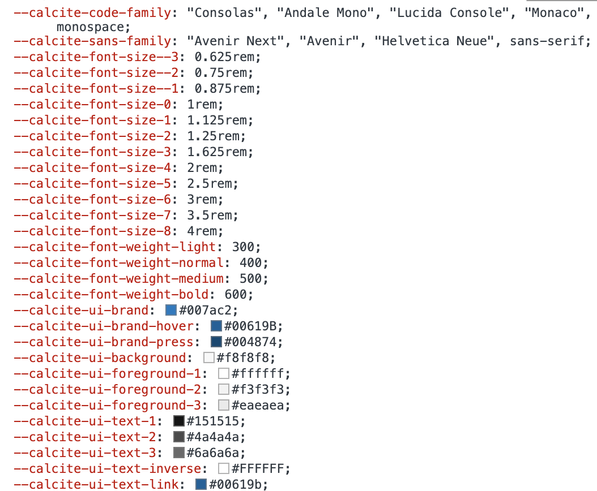
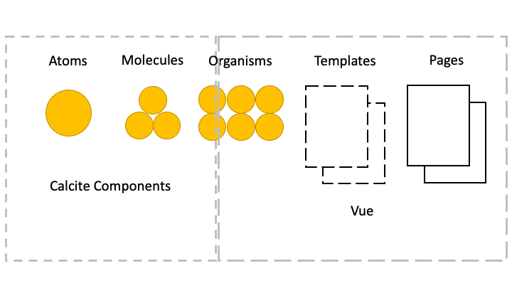

<!-- .slide: data-background="../img/2022/dev-summit/bg-1.png" data-background-size="cover -->
<h1 style="text-align: left; font-size: 80px;">ArcGIS Maps SDK for JavaScript:</h1>
<h2 style="text-align: left; font-size: 60px;">Best Practices for</h2>
<h2 style="text-align: left; font-size: 60px;">Building Apps</h2>
<p style="text-align: left; font-size: 30px;">Tristan Morrison and Jonathan Uihlein</p>

---

<!-- .slide: data-auto-animate data-background="../img/2022/dev-summit/bg-3.png" -->

## Agenda

<!--  -->

---

<!-- .slide: data-auto-animate data-background="../img/2022/dev-summit/bg-5.png" -->

<h2 style="text-align: left; font-size: 80px;">Modern Web</h2>
<h2 style="text-align: left; font-size: 80px;">Development</h2>

---

<!-- .slide: data-auto-animate data-background="../img/2022/dev-summit/bg-2.png" -->

## What is a tool?

- Code editors and IDEs
- Frameworks and libraries
- Package manager
- Browser development tools
- Preprocessors

---

<!-- .slide: data-auto-animate data-background="../img/2022/dev-summit/bg-2.png" -->

## And more...

- Automated tests
- Version control (VCS)
- Content management (CMS)
- Task runners

---

<!-- .slide: data-auto-animate data-background="../img/2022/dev-summit/bg-2.png" -->

## Modules

<div class="two-columns">
  <div class="left-column">

- Any file with a top level import or export 
- Organize app logic in a meaningful way
- Load only necessary files

  </div>
  <div class="right-column">
  Pure JS:
  <div data-fragment-id="add-widget" class="code-snippet">
      <pre>
        <code class="lang-js" data-trim data-line-numbers>
// start.js
(function () {
  // multiple js files of code
  // code1.js, code2.js, ...
  // finish.js
})();
        </code>
      </pre>
    </div>
    Module (AMD):
    <div data-fragment-id="add-widget" class="code-snippet">
      <pre>
        <code class="lang-js" data-trim data-line-numbers>
// start.js
require(["./code1", "code2"], function (code1, code2) {
  // Use code1 and code2.
});
        </code>
      </pre>
    </div>
  </div>
</div>

---

<!-- .slide: data-auto-animate data-background="../img/2022/dev-summit/bg-2.png" -->

## Simplest example

<div class="two-columns">
  <div class="left-column">
    <div data-fragment-id="add-widget" class="code-snippet">
      <pre>
        <code class="lang-html" data-trim data-line-numbers>
&lt;html&gt;
  &lt;head&gt;
    &lt;link rel=&quot;stylesheet&quot; href=&quot;./main.css&quot; /&gt;
    &lt;script src=&quot;https://js.arcgis.com/4.27/&quot;&gt;&lt;/script&gt;
    &lt;script&gt;
      require([&quot;esri/views/SceneView&quot;], function (SceneView) {
        var view = new SceneView({
          container: &quot;viewDiv&quot;,
          map: {
            basemap: &quot;topo&quot;,
          },
        });
      });
    &lt;/script&gt;
  &lt;/head&gt;
  &lt;body&gt;
    &lt;div id=&quot;viewDiv&quot;&gt;&lt;/div&gt;
  &lt;/body&gt;
&lt;/html&gt;
        </code>
      </pre>
    </div>
  </div>
  <div class="right-column">
    <div class="iframe-wrapper">
      <iframe data-src="./samples/simplest-example.html"></iframe>
    </div>
  </div>
</div>

---

<!-- .slide: data-auto-animate data-background="../img/2022/dev-summit/bg-2.png" -->

## Simplest example



---

<!-- .slide: data-auto-animate data-background="../img/2022/dev-summit/bg-2.png" -->

## ES Modules

<div class="two-columns">
  <div class="left-column">
    <div data-fragment-id="add-widget" class="code-snippet">
      <pre>
        <code class="lang-html" data-trim data-line-numbers>
&lt;script type=&quot;module&quot;&gt;
  import SceneView from 
    &quot;https://jsdev.arcgis.com/4.27/@arcgis/core/views/SceneView.js&quot;;
  var view = new SceneView({
    container: "viewDiv",
    map: {
      basemap: "topo",
    },
  });
&lt;/script&gt;
        </code>
      </pre>
    <div class="fragment">
      
    </div>
    <div class="fragment" style="background: rgba(0,0,0,0.5); color: white;    position: absolute;top: 0;margin-top: 300px;">
      -> hmmm &#129300; We need tools
    </div>
  </div>

  </div>
  <div class="right-column">
    <div class="iframe-wrapper">
      <iframe data-src="./samples/es-modules.html"></iframe>
    </div>
  </div>
</div>

---

<!-- .slide: data-auto-animate data-background="../img/2022/dev-summit/bg-2.png" -->

## Installation

- npm
  - JavaScript package manager
  - Download standalone tools for immediate use
  - Manage multiple versions of dependencies
- npx
  - Package runner
  - Does not require installing the package

---

<!-- .slide: data-auto-animate data-background="../img/2022/dev-summit/bg-2.png" -->

## Modules vs Packages

- Module
  - Located in the `node_modules` directory 
  - Can be loaded by the Node.js `require()` function
- Package
  - Described by a `package.json` file
---

<!-- .slide: data-auto-animate data-background="../img/2022/dev-summit/bg-2.png" -->

## Modules vs Packages

  - Not all modules are packages 
  - Modules are not required to have a `package.json` file

---

<!-- .slide: data-auto-animate data-background="../img/2022/dev-summit/bg-2.png" -->

## Tooling

- Flexibility
- Many options
  - Webpack
  - Rollup
  - Parcel
  - Vite
  - esbuild


---

<!-- .slide: data-auto-animate data-background="../img/2022/dev-summit/bg-2.png" -->

## Vite

- Wide support
  - TypeScript, JSX, CSS, Vue and more
- Fast!
  - Hot module replacement
  - Pre-bundling (cold start)

---
<!-- .slide: data-auto-animate data-background="../img/2022/dev-summit/bg-2.png" -->

## Vite

<div class="two-columns">
  <div class="left-column">
    <div data-fragment-id="add-widget" class="code-snippet">
      <pre>
        <code class="lang-html" data-trim data-line-numbers>
&lt;html&gt;
  &lt;head&gt;
    &lt;link
      rel=&quot;stylesheet&quot;
      href=
      &quot;https://js.arcgis.com/4.27/esri/themes/light/main.css&quot;
    /&gt;
    &lt;link rel=&quot;stylesheet&quot; href=&quot;./src/main.css&quot; /&gt;
    &lt;script type=&quot;module&quot; src=&quot;./src/main.js&quot;&gt;&lt;/script&gt;
  &lt;/head&gt;
  &lt;body&gt;
    &lt;div id=&quot;viewDiv&quot;&gt;&lt;/div&gt;
  &lt;/body&gt;
&lt;/html&gt;
        </code>
      </pre>
    </div>
    <div data-fragment-id="add-widget" class="code-snippet">
      <pre>
        <code class="lang-css" data-trim data-line-numbers>
html,
body,
#viewDiv {
  width: 100%;
  height: 100%;
  margin: 0;
  padding: 0;
}
        </code>
      </pre>
    </div>
  </div>
  <div class="right-column">
    <pre>
      <code class="lang-html" data-trim data-line-numbers>
        mkdir test-vite & cd test-vite
        npm init
        npm install --save @arcgis/core
        npm install --save vite
        npx vite dev
      </code>
    </pre>
    <br/>
     <pre class="fragment">
      <code class="lang-shell" data-trim data-line-numbers>
        npx vite build
      </code>
    </pre>
</div>

---

<!-- .slide: data-auto-animate data-background="../img/2022/dev-summit/bg-2.png" -->

## Webpack

"Simple" Config

```js
module.exports = {
  entry: {
    index: "./src/index.js",
  },
   // Important - JSAPI uses WebAssembly
   // node does not have the correct polyfills
  node: false,
  output: {
    path: path.join(__dirname, "dist"),
    // Can use hash with CDN
    // Hash will change and cause cache bust
    chunkFilename: "chunks/[id].js",
    publicPath: "",
    clean: true,
  },
  // Every file type needs a loader of some sort
  // Loader acts like a build pipeline
  module: {
    rules: [
      {
        test: /\.js$/,
        use: {
          loader: "babel-loader",
          options: {
            // Can have presets for different things like React
            presets: ["@babel/preset-env"],
          },
        },
      },
      {
        // Most popular CSS plugin for Webpack 5
        test: /\.css$/,
        use: [MiniCssExtractPlugin.loader, "css-loader"],
      },
    ],
  },
  plugins: [
    // Load template and inject variables
    new HtmlWebPackPlugin({
      title: "ArcGIS Maps SDK for JavaScript",
      template: "./public/index.html",
      filename: "./index.html",
      // Advanced
      chunksSortMode: "none",
      inlineSource: ".(css)$",
    }),
    // Chunk CSS gets loaded later
    new MiniCssExtractPlugin({
      filename: "[name].[chunkhash].css",
      chunkFilename: "[id].css",
    }),
  ],
};
```

---

<!-- .slide: data-auto-animate data-background="../img/2022/dev-summit/bg-2.png" -->

## Languages

- JavaScript
- TypeScript
- Web Assembly
- Elm
- Reason

---

<!-- .slide: data-auto-animate data-background="../img/2022/dev-summit/bg-2.png" -->

## Installing TypeScript

<div class="code-snippet">
  <pre>
    <code class="lang-json" data-trim data-line-numbers>
// Latest stable version
npm install typescript
    </code>
  </pre>
</div>
<div class="code-snippet">
  <pre>
    <code class="lang-json" data-trim data-line-numbers>
// Global context
npm i -g typescript
    </code>
  </pre>
</div>
---

<!-- .slide: data-auto-animate data-background="../img/2022/dev-summit/bg-2.png" -->

## TypeScript

<div class="code-snippet">
  <pre>
    <code class="lang-html" data-trim data-line-numbers>
&lt;script type="module" src="src/main.ts"&gt;&lt;/script&gt;
    </code>
  </pre>
</div>
<div class="code-snippet fragment">
  <pre>
    <code class="lang-json" data-trim data-line-numbers>
{
  {
  "compilerOptions": {
    "esModuleInterop": true,
    "lib": ["ES2020", "DOM"],
    "module": "ES2020",
    "moduleResolution": "Node",
    "resolveJsonModule": true,
    "sourceMap": true,
    "strict": true,
    "target": "ES2020"
  },
  "include": ["./src"]
}
    </code>
  </pre>
</div>

---

<!-- .slide: data-auto-animate data-background="../img/2022/dev-summit/bg-2.png" -->

## Adding some UI elements

<div class="two-columns">
  <div class="left-column">
    <div data-fragment-id="add-widget" class="code-snippet">
      <pre>
        <code class="lang-html" data-trim data-line-numbers>
&lt;div id=&quot;app&quot; class=&quot;esri-widget&quot;&gt;
  &lt;h2&gt;Choose basemap&lt;/h2&gt;
  &lt;select id=&quot;basemap&quot;&gt;
    &lt;option value=&quot;topo-vector&quot;&gt;Topo&lt;/option&gt;
    &lt;option value=&quot;satellite&quot;&gt;Satellite&lt;/option&gt;
    &lt;option value=&quot;oceans&quot;&gt;Oceans&lt;/option&gt;
    &lt;option value=&quot;osm&quot;&gt;Open Street Map&lt;/option&gt;
  &lt;/select&gt;
&lt;/div&gt;
        </code>
      </pre>
    </div>
    <div class="code-snippet">
      <pre>
        <code class="lang-css" data-trim data-line-numbers>
#app {
  padding: 20px;
}
&nbsp;
#app h2 {
  font-size: 15px;
}
&nbsp;
#app select {
  width: 100%;
}
</code>
</pre>
</div>
    <div data-fragment-id="add-widget" class="code-snippet">
      <pre>
        <code class="lang-js" data-trim data-line-numbers>
const dropdown = document.getElementById("basemap");
dropdown.onchange = (e) => {
  view.map.basemap = e.target.options[e.target.selectedIndex].value;
};
view.ui.add(document.getElementById("app"), "top-right");
</code>

</pre>
</div>
  </div>
  <div class="right-column">
    <iframe src="./samples/ui-example.html" style="height: 500px;"/>    
  </div>
</div>

---

<!-- .slide: data-auto-animate data-background="../img/2022/dev-summit/bg-2.png" -->

## Composition

<div>
  
</div>
<br/>
---

<!-- .slide: data-auto-animate data-background="../img/2022/dev-summit/bg-2.png" -->

## Styling

- SASS
- LESS
- Flexbox
- Tailwind
- CSS Modules
- CSS Grid

---

<!-- .slide: data-auto-animate data-background="../img/2022/dev-summit/bg-2.png" -->

## Styling

- Frameworks (Tailwind)
- Preprocessors (SASS)
- UI Kits (Bootstrap)

---
<!-- .slide: data-auto-animate data-background="../img/2022/dev-summit/bg-2.png" -->

## SASS

<div class="two-columns">
  <div class="left-column">
    <div data-fragment-id="add-widget" class="code-snippet">
      <pre>
        <code class="lang-html" data-trim data-line-numbers>
&lt;link rel=&quot;stylesheet&quot; href=&quot;./src/main.scss&quot; /&gt;
        </code>
      </pre>
    </div>
    <div data-fragment-id="add-widget" class="code-snippet fragment">
      <pre>
        <code class="lang-scss" data-trim data-line-numbers>
#app {
  padding: 20px;
  h2 {
    font-size: 15px;
  }
  select {
    width: 100%;
  }
}
</code>

</pre>
</div>

  </div>
  <div class="right-column">
    <pre>
      <code class="lang-html" data-trim data-line-numbers>
        npm install --save sass
      </code>
    </pre>
  </div>
</div>

---

<!-- .slide: data-auto-animate data-background="../img/2022/dev-summit/bg-2.png" -->

## SASS variables

```sass
$app-padding: 20px;

#app {
  padding: $app-padding;

  h2 {
    font-size: 15px;
  }

  select {
    width: 100%;
  }
}
```

```sass
@import "./variables";

#app {
  padding: $app-padding;
  ...
```

---

<!-- .slide: data-auto-animate data-background="../img/2022/dev-summit/bg-2.png" -->

## Calcite Components
<div class="two-columns">
  <div class="left-column">
    <div data-fragment-id="add-widget" class="code-snippet">
      <pre>
        <code class="lang-shell" data-trim data-line-numbers>
npm install --save @esri/calcite-components
        </code>
      </pre>
    </div>
    <div data-fragment-id="add-widget" class="code-snippet fragment">
      > MyWidget.tsx
      <pre>
        <code class="lang-typescript" data-trim data-line-numbers>
import "@esri/calcite-components/dist/components/calcite-select";
import "@esri/calcite-components/dist/components/calcite-option";
...
return (
  &lt;calcite-select id=&quot;basemap&quot;&gt;
    &lt;calcite-option value=&quot;satellite&quot;&gt;Satellite&lt;/calcite-option&gt;
    ...
  &lt;/calcite-select&gt;
);
      </code>
    </pre>
  </div>
  <div data-fragment-id="add-widget" class="code-snippet fragment">
      > main.ts
      <pre>
        <code class="lang-typescript" data-trim data-line-numbers>
import { setAssetPath } from 
  "@esri/calcite-components/dist/components";
// CDN hosted assets
setAssetPath(
"https://unpkg.com/@esri/calcite-components/dist/calcite/assets"
);
      </code>
    </pre>
  </div>

  </div>
  <div class="right-column">
    <iframe src="./samples/calcite-components.html" style="height: 500px;"/>    
  </div>
</div>

---

<!-- .slide: data-auto-animate data-background="../img/2022/dev-summit/bg-2.png" -->

## CSS Variables

<div class="two-columns">
  <div class="left-column">
    <div data-fragment-id="add-widget" class="code-snippet">
      <pre>
        <code class="lang-css" data-trim data-line-numbers>
--calcite-ui-brand: green;
--calcite-ui-text-1: #212020;
--calcite-font-size-0: 1rem;
      </code>
    </pre>
  </div>
  <div data-fragment-id="add-widget" class="code-snippet">
      <pre>
        <code class="lang-css" data-trim data-line-numbers>
#app {
  color: --calcite-ui-text-1;
}
    </pre>
  </div>

  </div>
  <div class="right-column">
    
  </div>
</div>

---

<!-- .slide: data-auto-animate data-background="../img/2022/dev-summit/bg-2.png" -->

## Frameworks

- React
- Vue
- Angular
- Svelte
- Ember
- Solid
- ... and more, and more

---

<!-- .slide: data-auto-animate data-background="../img/2022/dev-summit/bg-2.png" -->

## Vue

- Using Calcite Components?
  - Don't let Vue compile them

```js
compilerOptions: {
  isCustomElement: (tag) => tag.includes('calcite-'),
},
```

---

<!-- .slide: data-auto-animate data-background="../img/2022/dev-summit/bg-2.png" -->

## Vue

- Limitations
- Vue reactivity uses Proxy
  - Don't store ArcGIS instances directly

```js
import { reactive, watchEffect } from "vue";

const data = reactive({ map: webmap, layer: null });

watchEffect(() => {
  if (data.layer) {
    // Errors
    data.map.add(data.layer);
  }
});

// Errors
data.layer = new FeatureLayer(params);
```

---


<!-- .slide: data-auto-animate data-background="../img/2022/dev-summit/bg-2.png" -->

## Why

- Don't get overwhelmed
- Focus on what works for you
- Ignore the noise
- _Your users don't care_

---

<!-- .slide: data-auto-animate data-background="../img/2022/dev-summit/bg-2.png" -->

## Powerplant Viewer Demo
<p style="text-align: center; font-size: 30px;"><a href="https://github.com/odoe/arcgis-create-t3-app">github.com/odoe/arcgis-create-t3-app</a></p>

- NextJS
- React
- TypeScript
- tRPC


---

<!-- .slide: data-auto-animate data-background="../img/2022/dev-summit/bg-2.png" -->

## Design



---

<!-- .slide: data-auto-animate data-background="../img/2022/dev-summit/bg-2.png" -->

## Vite Config

```ts
// vite.config.ts
import { defineConfig } from "vite";
import vue from "@vitejs/plugin-vue";
export default defineConfig({
  plugins: [
    vue({
      template: {
        compilerOptions: {
          isCustomElement: (tag) => tag.includes("calcite-"),
        },
      },
    }),
  ],
});
```

---

<!-- .slide: data-auto-animate data-background="../img/2022/dev-summit/bg-2.png" -->

## Authentication and API Keys

- OAuth
  - Useful if using _private_ content
- API Key
  - Using platform basemaps and/or location services
- Cannot use both together

---

<!-- .slide: data-auto-animate data-background="../img/2022/dev-summit/bg-2.png" -->

## Authentication and API Keys

- Use Environment Variables

```js
// supported in most build tools
config.apiKey = process.env.API_KEY;

// vite uses import.meta
config.apiKey = import.meta.env.VITE_API_KEY;
```

- Please do not commit your keys to git

---

<!-- .slide: data-auto-animate data-background="../img/2022/dev-summit/bg-2.png" -->

## CDN

- Assets/workers loaded via CDN by default
- Can still use AMD CDN for small apps

---

<!-- .slide: data-auto-animate data-background="../img/2022/dev-summit/bg-2.png" -->

### **Where can I get more info?**

- SDK Documentation
- Esri-related training and webinars
- ArcGIS Blogs
- GeoNet, StackExchange, etc.

---

<!-- .slide: data-auto-animate data-background="images/survey.png" -->

---

<!-- .slide: data-auto-animate data-background="../img/2022/dev-summit/bg-8.png" -->
